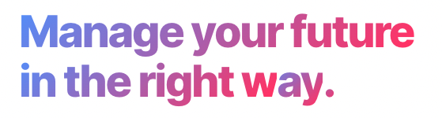

# [Mentomz](https://www.mentomz.com/) Syllabus

[Mentomz](https://www.mentomz.com/) is a Frontend Guide that includes a collection of free and paid courses from **Udemy, Udacity, Articles, YouTube Videos, and other sources** to help you get started quickly.

**Mentomz** helps you focus only on learning by picking clearly the courses for you to master web development art.

## Why did I create this?

I Created these tracks to give the people who need to start the two missing keys

- Clear Guide for what needed to be mastered
- A community of engineers helps him/her when stuck [join discord now🔥](https://bit.ly/mz-discord)

## Tracks

> Do Intership to Expert, in order, if you're new

### ⛳️  Intership

The first step you will need to make to jump smothely and easly in the frontend development field

🚀 🔗  [Learn more about content](./curriculum/intership.md)

### ⛳️  Foundational

The Foundational track allows you to steadily build your programming abilities through a fully integrated and stackable learning path. The training begins with no programming expertise and progresses to become a front-end developer.

🚀 🔗  [Learn more about content](./curriculum/foundational.md)

### ⛳️  Professional

by the end of professional track you will be able to build high quality software using javascript as the selected courses/article/concepts will give you the knowledge to master javascript and understand the hardest concepts on it.

🚀 🔗  [Learn more about content](./curriculum/professional.md)

### 🧑🏻‍💻  Expert

Comming Soon 📝

## FAQs

> Can I join the community and start the internship wihout pay anything?

yes you can, you will find all the syllabus of the intern at [discord](https://bit.ly/mz-discord) in the `📑fe-internship-guide` and follow up on `#🚀coding-on-weekend` channel.

> How to download Mentomz material?

to get access to plan of study to any track you will need to buy it frist from  [Mentomz](https://www.mentomz.com/#pricing) once you buy it you receive an email with the template link, Open it, then click "Duplicate" on the top right corner to duplicate it to your workspace.

Send your feedback or queries to 📧 mohammedelzanaty129@gmail.com

If you're a student, from a low-income country, or can’t afford it due to financial issues, send an email to [📧 mohammedelzanaty129@gmail.com](mailto:mohammedelzanaty129@gmail.com) and I'll do my best to make it work for you.
