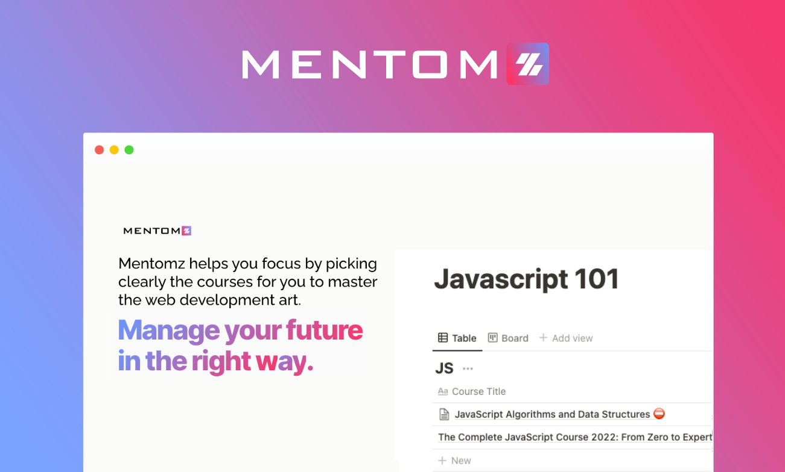
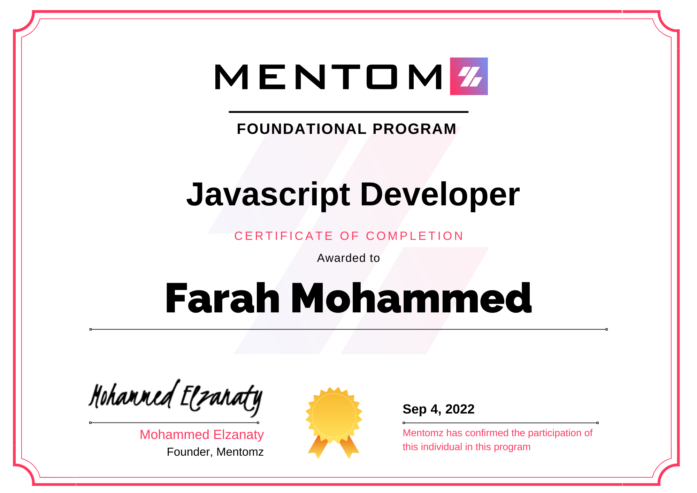

# [Mentomz](https://www.mentomz.com/) Foundational

## Syllabus

- Learn Programming Fundamentals Path from LinkedIn Learning

- Web Fundamentals, HTML and CSS
  
  - Internet Fundamentals
  - Intro to HTML and CSS
  - Responsive Web Design Fundamentals
  - Responsive Images

- Javascript 101
  - [Complete Intro to Javascript](https://www.youtube.com/playlist?list=PLLWuK602vNiU-kIpNuw5Z7HRbV4pBaHlL)
  - [egFwd Professional Web Development](https://egfwd.com/specializtion/web-development-professional/)

- Task Manager

- Notes

If you complete the content you will get a Memntomz certification like image below

