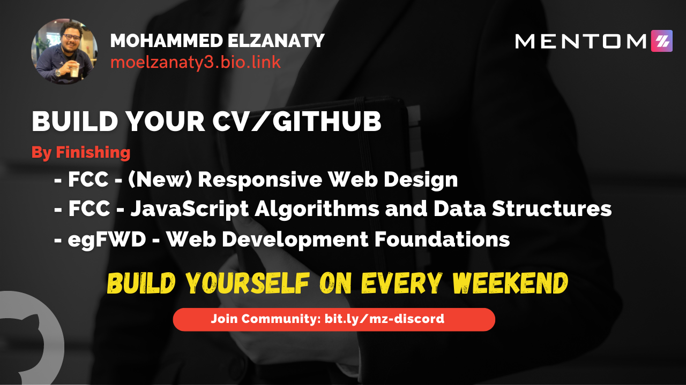
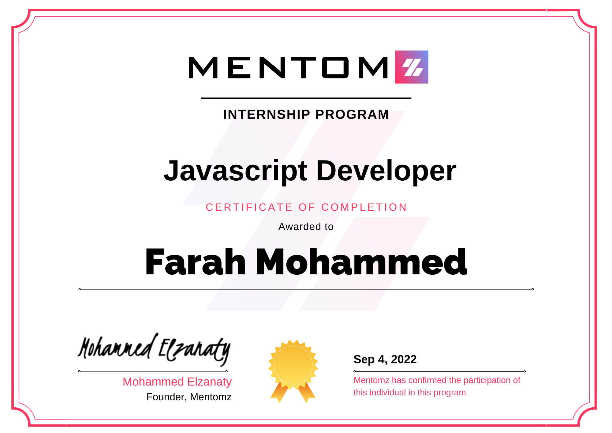

# [Mentomz](https://www.mentomz.com/) Internship

## Syllabus

- Plan to study [FCC responsive](https://www.freecodecamp.org/learn/2022/responsive-web-design/) certificate

- Plan to study [FCC Javascript](https://www.freecodecamp.org/learn/javascript-algorithms-and-data-structures/) and Data Structure

- [egFwd Web Development Foundations](https://egfwd.com/specializtion/web-development-foundations/)

- Task Manager

- Notes

If you complete the first two certificates from FreeCodeCamp and web development foundation from udacity you will get a Memntomz certification like image below

