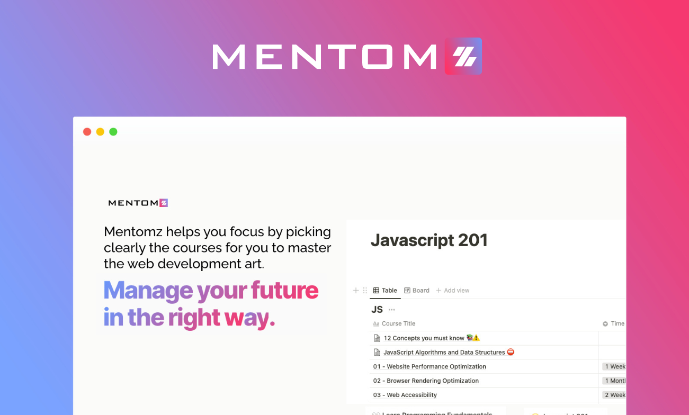

# [Mentomz](https://www.mentomz.com/) Professional

## Syllabus

- Javascript 201
  - 12 Concepts in JS you must know
  - Website Performance Opitimization
  - Broswer Rendering Opitimization
  - Web Accessibility
  - Javascript Testing
  - Javascript the Hard Parts

- ReactJS
  
  - [Front End Development Libraries](https://www.freecodecamp.org/learn/front-end-development-libraries/)
  - [egFwd - Become a React Developer](https://egfwd.com/specializtion/react-development/)
  - [Complete Intro to React](https://www.youtube.com/playlist?list=PLLWuK602vNiWEV2_JaGvNLUymUPXZv63r)
  - [React - The Complete Guide (incl Hooks, React Router, Redux)](https://www.udemy.com/course/react-the-complete-guide-incl-redux/) - [Optional]
  - [Modern React with Redux](https://www.udemy.com/course/react-redux/?src=sac&kw=Modern+React+with+Redux) - [Optional]
  - [Scrimba: Learn React for free](https://scrimba.com/learn/learnreact) - [Optional]

- Task Manager

- Notes

If you complete the content you will get a Memntomz certification like image below

